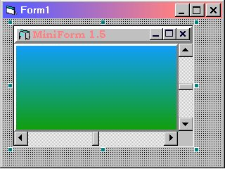

<div align="center">

## MiniForm 1\.5


</div>

### Description

This is a free container control I made because I needed an ocx that I couldn't find searching

the Net.

I would like to know if you like it (VOTE!), and if it's useful for your projects as I hope.

I worked very hard to this project so please, report to me any bug you may encounter, I will

correct them. I will add any other feature you ask to me.

Main features:

-Container: you can scroll controls you placed on Miniform in any direction.

-UseAsForm: you can use MiniForm as a form, with title bar 3D and others visual effects!

-Gradient: shade your MiniForm control with tons of different random or selected colours!

-Use your MiniForm control as a 3D window, or 3D button adding a few lines of code!

-Set an icon for the title bar!

-Connect your control with an Access database (supports DAO, not yet ADO).

-Includes many properties and methods of standard forms!
 
### More Info
 
This ocx is made with standard visual basic components, so no installation is required;simply copy it into your windows\system directory and

add it into a new VB project.

Custom control.


<span>             |<span>
---                |---
**Submitted On**   |2000-11-28 09:42:56
**By**             |[Stefano Benso](https://github.com/Planet-Source-Code/PSCIndex/blob/master/ByAuthor/stefano-benso.md)
**Level**          |Advanced
**User Rating**    |4.2 (21 globes from 5 users)
**Compatibility**  |VB 5\.0
**Category**       |[Custom Controls/ Forms/  Menus](https://github.com/Planet-Source-Code/PSCIndex/blob/master/ByCategory/custom-controls-forms-menus__1-4.md)
**World**          |[Visual Basic](https://github.com/Planet-Source-Code/PSCIndex/blob/master/ByWorld/visual-basic.md)
**Archive File**   |[CODE\_UPLOAD1215211282000\.zip](https://github.com/Planet-Source-Code/stefano-benso-miniform-1-5__1-13178/archive/master.zip)

### API Declarations

```
'Move the MiniForm within its parent or with the form
Public Const HTCAPTION = 2
Public Const WM_NCLBUTTONDOWN = &HA1
Public Declare Function ReleaseCapture Lib "user32" () As Long
Public Declare Function SendMessage Lib "user32" Alias "SendMessageA" (ByVal hwnd As Long, ByVal wMsg As Long, ByVal wParam As Long, lParam As Any) As Long
'Variabili per iconizzare il controllo per UseAsForm
Declare Function CloseWindow Lib "user32" (ByVal hwnd As Long) As Long
'API Decalaration for FlashWindow
Declare Function FlashWindow Lib "user32" (ByVal hwnd As Long, _
 ByVal bInvert As Long) As Long
'Declarations for ExplodeForm
Type RECT
    Left As Long
    Top As Long
    Right As Long
    Bottom As Long
End Type
Declare Function CreateSolidBrush Lib "gdi32" (ByVal crColor As Long) As Long
Declare Function DeleteObject Lib "gdi32" (ByVal hObject As Long) As Long
Declare Function GetDC Lib "user32" (ByVal hwnd As Long) As Long
Declare Function GetWindowRect Lib "user32" (ByVal hwnd As Long, _
  lpRect As RECT) As Long
Declare Function ReleaseDC Lib "user32" (ByVal hwnd As Long, _
  ByVal hdc As Long) As Long
Declare Function SelectObject Lib "gdi32" (ByVal hdc As Long, _
  ByVal hObject As Long) As Long
Declare Function Rectangle Lib "gdi32" (ByVal hdc As Long, _
  ByVal x1 As Long, ByVal y1 As Long, _
  ByVal x2 As Long, ByVal y2 As Long) As Long
```


